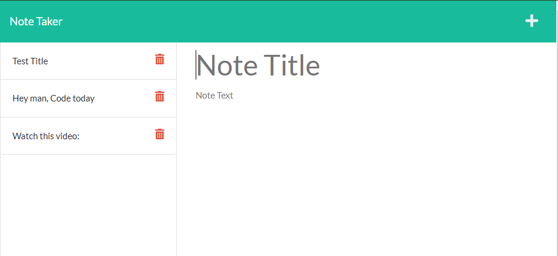

  # notetaker
  
  ## License
  

  ### Screenshots
  
  
  ## Description
  A web app you can use to take notes on any subject, or to make little reminders for yourself on things you need to do or want to do throughout the day.
  ## Table of Contents
- [notetaker](#notetaker)
  - [License](#license)
    - [Screenshots](#screenshots)
  - [Description](#description)
  - [Table of Contents](#table-of-contents)
  - [Installation](#installation)
  - [Usage](#usage)
  - [Contributions](#contributions)
  - [Test Instructions](#test-instructions)
  - [Contact](#contact)
